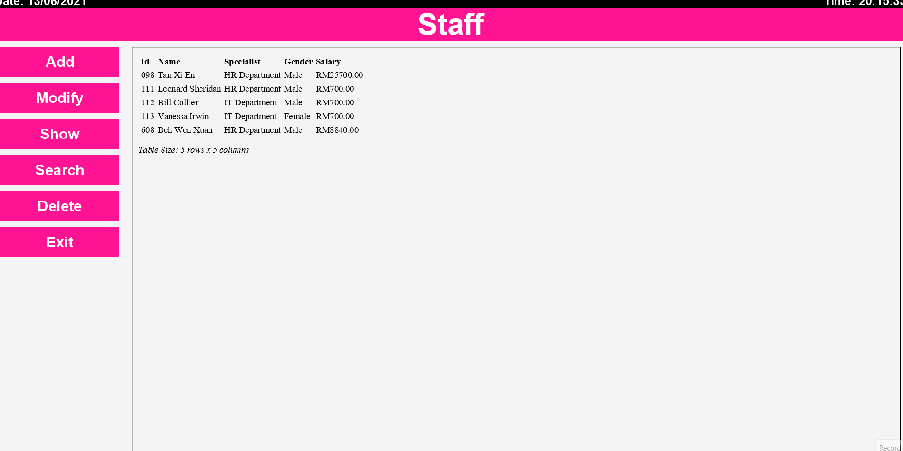
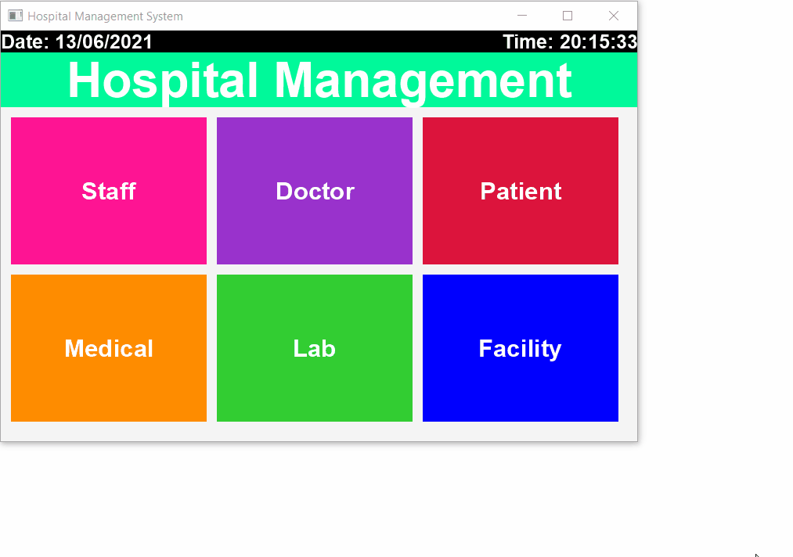

# Hospital Management System
Java Project on Hospital Management System\
Task: Design a Java Application that is able to handle a hospital daily operation

## Learning Objective
1. Familiarize myself with OOP Concepts
2. Learn about Java GUI and how to make a GUI application using Java Fx

## IDE Used
Eclipse SDK Version 2020-09 (4.17)

## List of Dependencies Used
* Java SE 8
* JavaFX 8

## Program Functions
1. The system is able to manage 6 entities - Staff, Doctor, Patient, Medical, Lab and Facility
2. The system is able to perform Basic CURD (Create, Read, Update and Delete) Functions for all entities
3. The system is able to search and filter entites
4. The system provides basic input validation

## Demonstration
1. Navigation
   
2. Creating An Entity
   
3. Modify an Entity
   
4. Show Entity
   
5. Delete Entity
   
6. Search and Filter Entity
   
*Note: This Hospital Management System does not involve any SQL. It is made entirely out of JAVA only. This program was an exercise to improve my expertise over Java Language*
